# Installing Node.js and Postgresql on Windows for the CTP-Microblog

Due to complications with Windows support for symlinks in share folders, the suggested installion instructions using Vagrant do not work without considerable configuration, and even then, some systems still do not work.

We are now recommending Windows users to install Node.js and Postgres directly on their Windows OS using the following instructions.

## Getting and installing Node.js

1. Visit [https://nodejs.org/en/](https://nodejs.org/en/)
2. Download the latest Version **6.x** installer for your OS
    * 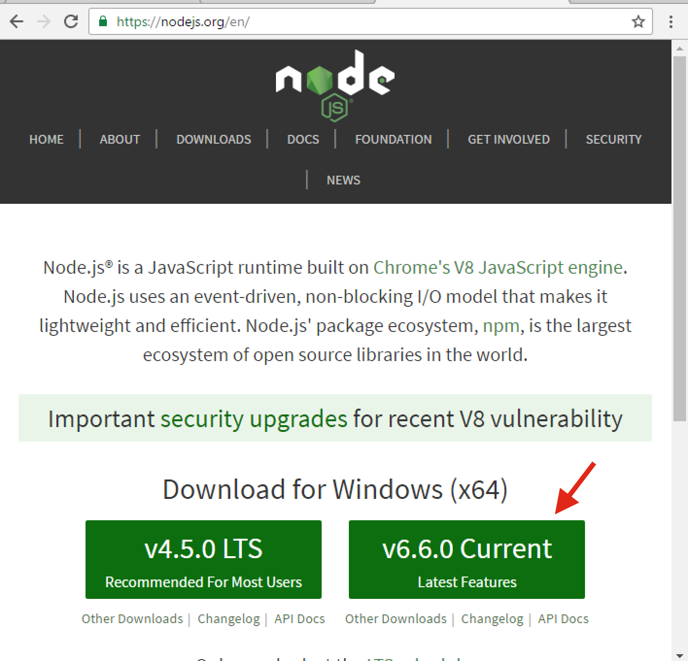
3. Locate and run the installer (Accept default settings)

The Node.js installer configures your environment variables and creates a "Node.js command prompt" in your Programs folder. This command prompt configures the environment so that you can run `npm` and `node` commands from there.

## Clone CTP-Microblog and run it

1. Open a command prompt (the "Node.js command prompt" is recommended)
2. Change directories into a desired location to store the microblog code
3. Clone the code
    * `git clone https://github.com/medgardo/ctp-microblog.git`
4. `cd .\ctp-microblog\blog`
5. `npm install`
    * Do it a few times if you have errors (some servers are broken)
    * Ignore `npm WARN` messages
6. `npm start`

At this point nodemon should start the microblog, but you will receive a SEQUELIZE connection error. You will get that if you don't have a Postgres database installed. You can leave nodemon running and proceed to the next section. 

> If you have Postgres installed and running, you may see the following error:
> 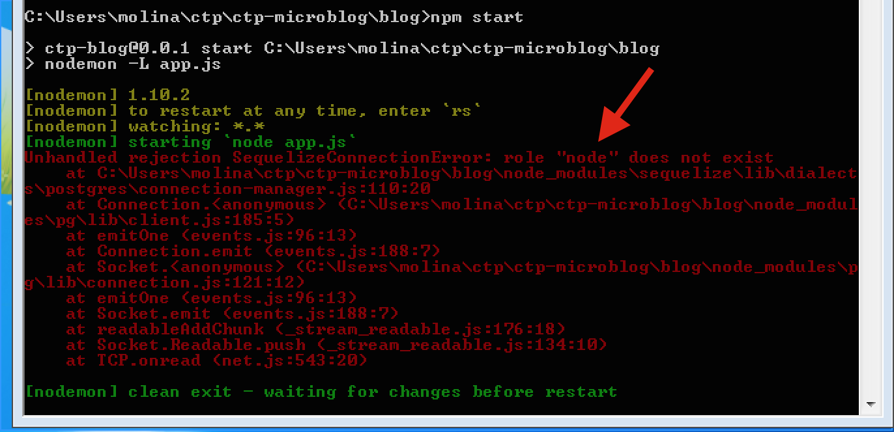
> 
> In this case proceed to the Create Postgres User and DB sections

## Getting and installing Postgresql

1. Visit [https://bigsql.org/postgresql/installers.jsp](https://bigsql.org/postgresql/installers.jsp)
2. Download the 9.5.x version for your OS
    * 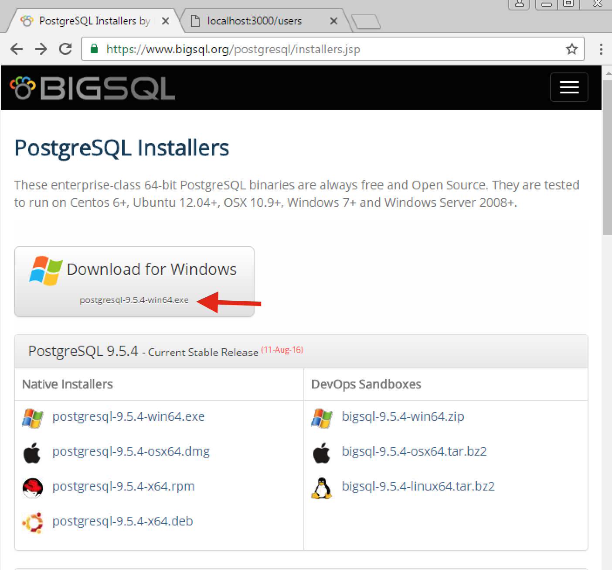
3. Locate and run the installer (make sure to install the "pgAdmin III" tool)
    * 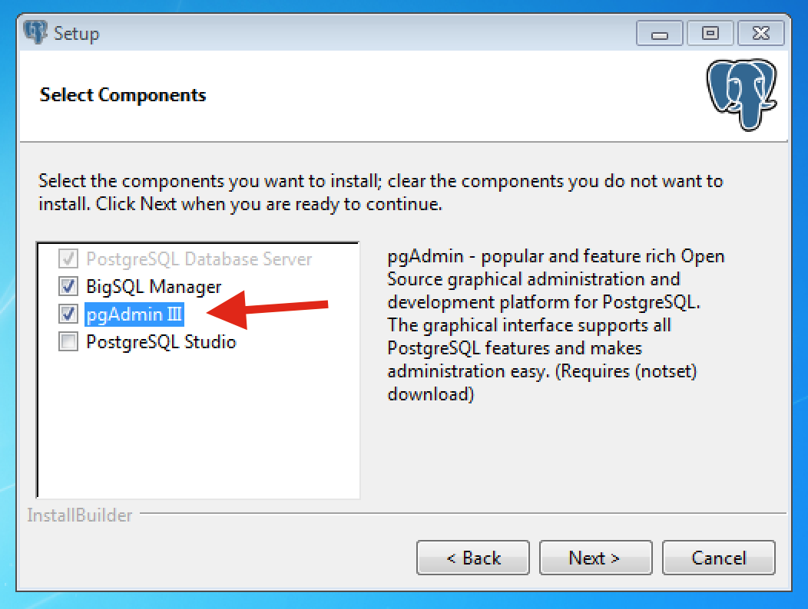
    * 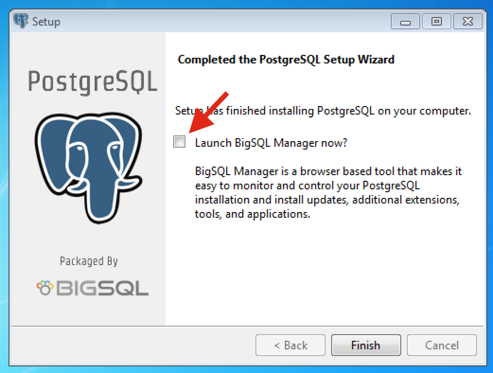
4. Once sucessfully installed, run the "pgAdmin III" tool and create a user and a database. Instructions in the following sections

## Creating a Postgres User

The CTP-Microblog code is configured to expect a database user with a name of "node" and password "ctp2016". This is how we create that user:

1. Launch the "pgAdmin III" tool
2. Open the "Localhost(localhost:5431)" server
3. Right click on the `Login Roles` and click on `New Login Role...`
    * 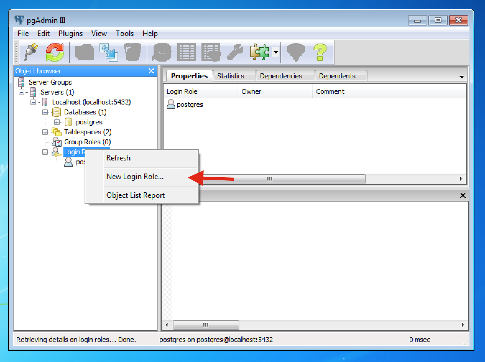
4. Use the name `node`
    * 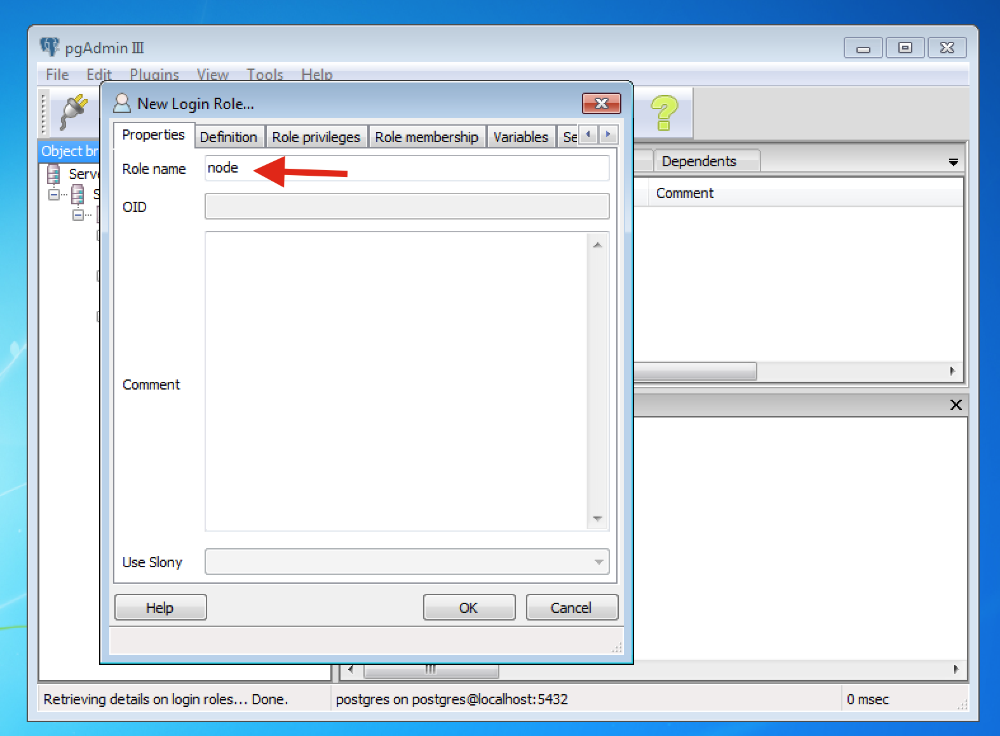
5. Provide the password `ctp2016`
    * 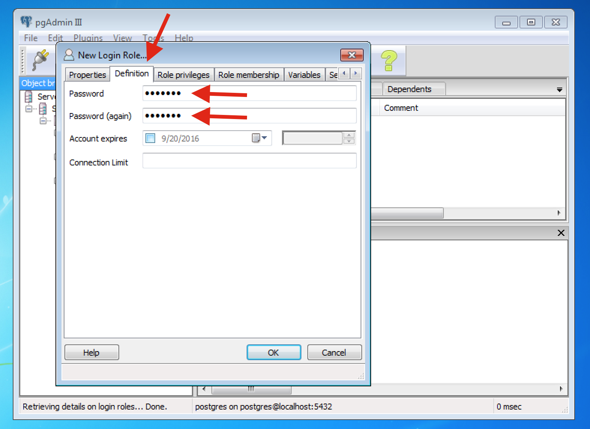
6. Give the role "superuser" rights (this is only for development, never do this in production)
    * 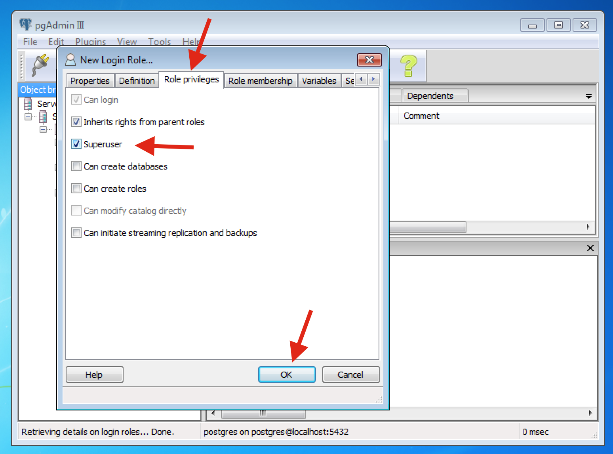
7. Press OK.

## Creating a Postgres Database

The CTP-Microblog code is configured to expect a database called "blog". This is how we create that Database:

1. Launch the "pgAdmin III" tool
2. Open the "Localhost(localhost:5431)" server
3. Right click on the `Databases (1)` and click on `New Database...`
    * 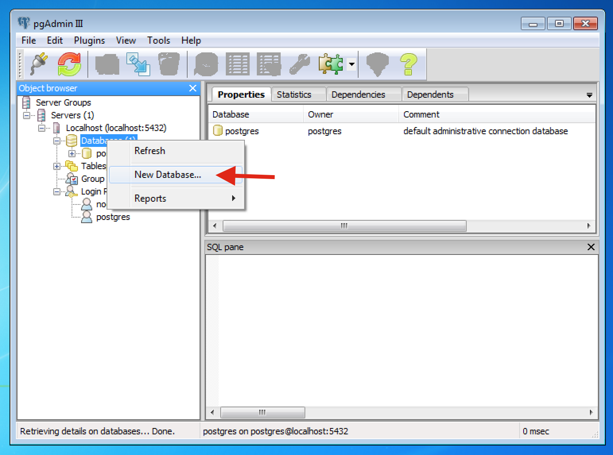
3. Provide the name `blog`
    * 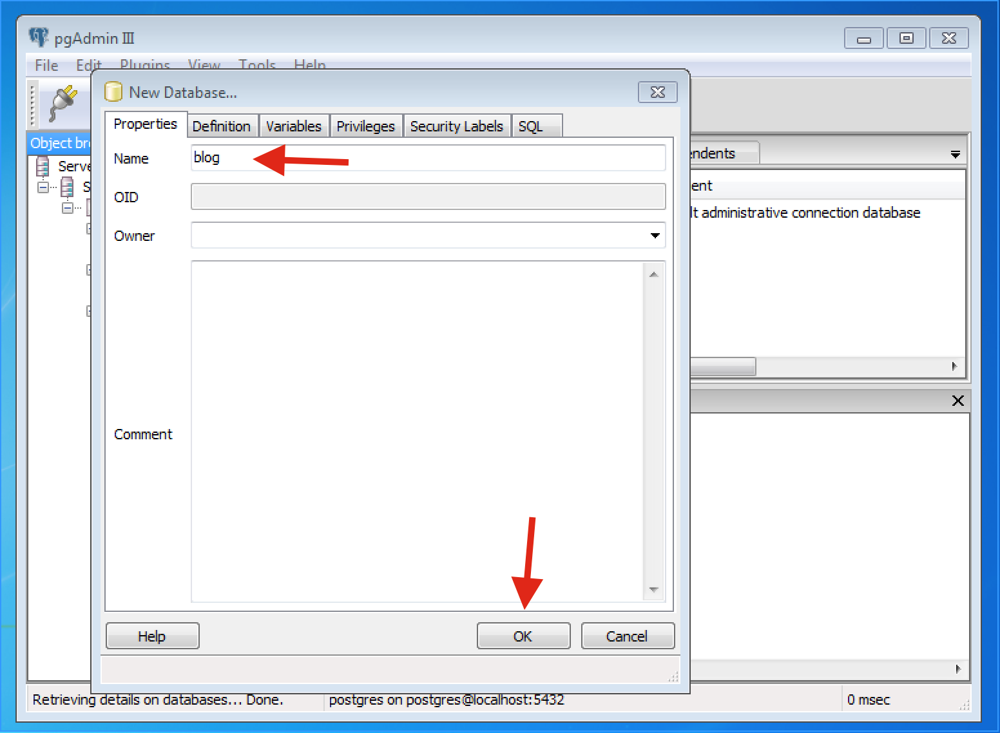
4. Press OK.

## Restart the Microblog

If you left nodemon running and waiting after the missing database error, you can now type in `rs` and press ENTER and the microblog will be reloaded. Otherwise, launch the command prompt again, navigate to the microblog code and run `npm start`.

You can now visit the app from a web browser by going to [http://localhost:3000](http://localhost:3000)

